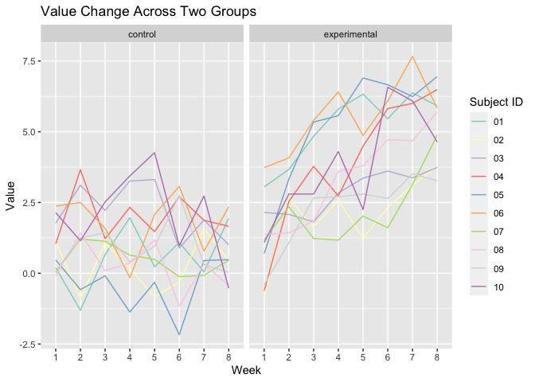

Homework5
================
Manye Dong
2023-11-06

``` r
library(tidyverse)
```

## Problem 1

``` r
homicide = read_csv("datasets/homicide-data.csv")
```

    ## Rows: 52179 Columns: 12
    ## ── Column specification ────────────────────────────────────────────────────────
    ## Delimiter: ","
    ## chr (9): uid, victim_last, victim_first, victim_race, victim_age, victim_sex...
    ## dbl (3): reported_date, lat, lon
    ## 
    ## ℹ Use `spec()` to retrieve the full column specification for this data.
    ## ℹ Specify the column types or set `show_col_types = FALSE` to quiet this message.

``` r
head(homicide)
```

    ## # A tibble: 6 × 12
    ##   uid   reported_date victim_last victim_first victim_race victim_age victim_sex
    ##   <chr>         <dbl> <chr>       <chr>        <chr>       <chr>      <chr>     
    ## 1 Alb-…      20100504 GARCIA      JUAN         Hispanic    78         Male      
    ## 2 Alb-…      20100216 MONTOYA     CAMERON      Hispanic    17         Male      
    ## 3 Alb-…      20100601 SATTERFIELD VIVIANA      White       15         Female    
    ## 4 Alb-…      20100101 MENDIOLA    CARLOS       Hispanic    32         Male      
    ## 5 Alb-…      20100102 MULA        VIVIAN       White       72         Female    
    ## 6 Alb-…      20100126 BOOK        GERALDINE    White       91         Female    
    ## # ℹ 5 more variables: city <chr>, state <chr>, lat <dbl>, lon <dbl>,
    ## #   disposition <chr>

``` r
homicide_clean =
  homicide |>
  janitor::clean_names() |>
  mutate(state = replace(state, state == "wI", "WI")) |> 
  mutate(city_state = paste(city, state, sep = ", ")) |>
  filter(city_state != "Tulsa, AL") |> 
  drop_na()
```

The data has 52118 rows and 13 columns. Important features include xxx

``` r
homicide_summarize = 
  homicide_clean |>
  group_by(city_state) |>
  summarise(total_homicide = n(), 
            unsolved_homicide = sum(disposition %in% c("Closed without arrest", "Open/No arrest")))

homicide_summarize
```

    ## # A tibble: 50 × 3
    ##    city_state      total_homicide unsolved_homicide
    ##    <chr>                    <int>             <int>
    ##  1 Albuquerque, NM            375               144
    ##  2 Atlanta, GA                973               373
    ##  3 Baltimore, MD             2827              1825
    ##  4 Baton Rouge, LA            424               196
    ##  5 Birmingham, AL             799               346
    ##  6 Boston, MA                 612               309
    ##  7 Buffalo, NY                520               318
    ##  8 Charlotte, NC              687               206
    ##  9 Chicago, IL               5535              4073
    ## 10 Cincinnati, OH             694               309
    ## # ℹ 40 more rows

``` r
# Subset the data for Baltimore, MD
homicide_prop_test = 
  homicide_clean |>
  filter(city_state == "Baltimore, MD")

# Calculate the number of unsolved homicides
unsolved_count = sum(homicide_prop_test$disposition %in% c("Closed without arrest", "Open/No arrest"))

# The total number of homicides
total_homicides = nrow(homicide_prop_test)

# Perform the proportion test
prop_test_result = prop.test(x = unsolved_count, n = total_homicides)
```

``` r
# Use broom::tidy to tidy up the prop.test result
tidy_result = broom::tidy(prop_test_result)

# Pull the estimated proportion and confidence intervals
tidy_result = 
  tidy_result |>
  select(estimate, conf.low, conf.high)

tidy_result
```

    ## # A tibble: 1 × 3
    ##   estimate conf.low conf.high
    ##      <dbl>    <dbl>     <dbl>
    ## 1    0.646    0.628     0.663

Now run prop.test for each of the cities in your dataset, and extract
both the proportion of unsolved homicides and the confidence interval
for each. Do this within a “tidy” pipeline, making use of purrr::map,
purrr::map2, list columns and unnest as necessary to create a tidy
dataframe with estimated proportions and CIs for each city.

``` r
# A function to run prop.test on the provided numbers
run_prop_test = function(total, unsolved) {
  prop.test(x = unsolved, n = total)
}
```

``` r
# Now create a nested data frame grouped by city
nested_data = 
  homicide_clean |>
  group_by(city_state) |>
  summarize(total_homicide = n(), 
            unsolved_homicide = sum(disposition %in% c("Closed without arrest", "Open/No arrest"))) |>
  nest(data = c(total_homicide, unsolved_homicide))
```

``` r
# Run the prop.test for each city and tidy the results
results = 
  nested_data |>
  mutate(prop_test_results = map(data, ~run_prop_test(.x$total_homicide, .x$unsolved_homicide))) |>
  mutate(tidy_results = map(prop_test_results, broom::tidy)) |>
  select(city_state, tidy_results) |>
  unnest(tidy_results) |>
  select(city_state, estimate, conf.low, conf.high)
#|> mutate(CI = paste(conf.low, conf.high, sep = ", "))

head(results)
```

    ## # A tibble: 6 × 4
    ##   city_state      estimate conf.low conf.high
    ##   <chr>              <dbl>    <dbl>     <dbl>
    ## 1 Albuquerque, NM    0.384    0.335     0.436
    ## 2 Atlanta, GA        0.383    0.353     0.415
    ## 3 Baltimore, MD      0.646    0.628     0.663
    ## 4 Baton Rouge, LA    0.462    0.414     0.511
    ## 5 Birmingham, AL     0.433    0.398     0.468
    ## 6 Boston, MA         0.505    0.465     0.545

Create a plot that shows the estimates and CIs for each city – check out
geom_errorbar for a way to add error bars based on the upper and lower
limits. Organize cities according to the proportion of unsolved
homicides.

``` r
# Make sure results have city_state as a factor ordered by the estimate
results$city_state <- factor(results$city_state, levels = results$city_state[order(results$estimate)])

# Create the plot
ggplot(results, aes(x = city_state, y = estimate)) +
  geom_point() +
  geom_errorbar(aes(ymin = conf.low, ymax = conf.high), width = 0.2) +
  coord_flip() +
  labs(x = "City", y = "Proportion of Unsolved Homicides", title = "Proportion of Unsolved Homicides by City") +
  theme(axis.text.x = element_text(angle = 45, vjust = 0.5))
```

<!-- -->

## Problem 2

``` r
longitudinal = function(path,filename) {
  
  df = 
    read_csv(path) |>
    janitor::clean_names() |>
    mutate(id = filename) |>
    pivot_longer(
      cols = -id,
      names_to = "week",
      values_to = "value",
      names_prefix = "week_") |>
    separate(id,c("arm", "subject_id"),  sep = "_") |>
    mutate(
      arm = recode(arm, con = "control", exp = "experimental"),
      subject_id = gsub("\\.csv$","",subject_id))

  df
}
```

``` r
files = list.files("./datasets/study_data", full.names = TRUE)
```

``` r
tidied_df = 
  purrr::map(files, ~ longitudinal(.x, basename(.x))) |> 
  bind_rows()
```

``` r
tail(tidied_df)
```

    ## # A tibble: 6 × 4
    ##   arm          subject_id week  value
    ##   <chr>        <chr>      <chr> <dbl>
    ## 1 experimental 10         3      2.8 
    ## 2 experimental 10         4      4.3 
    ## 3 experimental 10         5      2.25
    ## 4 experimental 10         6      6.57
    ## 5 experimental 10         7      6.09
    ## 6 experimental 10         8      4.64

Make sure weekly observations are tidy:

``` r
tidied_df |>
  group_by(week) |> 
  summarise(n = n())
```

    ## # A tibble: 8 × 2
    ##   week      n
    ##   <chr> <int>
    ## 1 1        20
    ## 2 2        20
    ## 3 3        20
    ## 4 4        20
    ## 5 5        20
    ## 6 6        20
    ## 7 7        20
    ## 8 8        20

``` r
tidied_df |>
  group_by(subject_id) |> 
  summarise(n = n())   
```

    ## # A tibble: 10 × 2
    ##    subject_id     n
    ##    <chr>      <int>
    ##  1 01            16
    ##  2 02            16
    ##  3 03            16
    ##  4 04            16
    ##  5 05            16
    ##  6 06            16
    ##  7 07            16
    ##  8 08            16
    ##  9 09            16
    ## 10 10            16

``` r
tidied_df |>
  group_by(week, subject_id) |> 
  summarise(n = n())
```

    ## `summarise()` has grouped output by 'week'. You can override using the
    ## `.groups` argument.

    ## # A tibble: 80 × 3
    ## # Groups:   week [8]
    ##    week  subject_id     n
    ##    <chr> <chr>      <int>
    ##  1 1     01             2
    ##  2 1     02             2
    ##  3 1     03             2
    ##  4 1     04             2
    ##  5 1     05             2
    ##  6 1     06             2
    ##  7 1     07             2
    ##  8 1     08             2
    ##  9 1     09             2
    ## 10 1     10             2
    ## # ℹ 70 more rows

Make a spaghetti plot:

``` r
tidied_df |>
  ggplot(aes(x = week, y = value, color = subject_id)) +
  geom_line(aes(group = subject_id), se = FALSE) +
  facet_grid(~arm) +
  scale_color_brewer(palette = "Set3") + 
  labs(x = "Week", y = "Value", title = "Value Change Across Two Groups", col = "Subject ID")
```

    ## Warning in geom_line(aes(group = subject_id), se = FALSE): Ignoring unknown
    ## parameters: `se`

<!-- -->
Observations:

## Problem 3

``` r
set.seed(1)
```

``` r
one_sample = function(mu, n = 30, sd = 5){
  x = rnorm(n = n, mean = mu, sd = sd)
  sim_result = t.test(x, mu = 0, alternative = "two.sided", conf.level = 0.95) |>
    broom::tidy() |> 
    select(estimate, p.value)
}
```

Repeat for all values of mu:

``` r
all_sample = 
  expand_grid(mu = c(0,1,2,3,4,5,6), iter = 1:5000) |> 
  mutate(estimate_df = map(mu, one_sample)) |> 
  unnest(estimate_df) |> 
  mutate(power = p.value < 0.05)
```

``` r
all_sample
```

    ## # A tibble: 35,000 × 5
    ##       mu  iter estimate p.value power
    ##    <dbl> <int>    <dbl>   <dbl> <lgl>
    ##  1     0     1    0.412  0.629  FALSE
    ##  2     0     2    0.664  0.368  FALSE
    ##  3     0     3    0.551  0.534  FALSE
    ##  4     0     4    0.567  0.487  FALSE
    ##  5     0     5   -1.65   0.0599 FALSE
    ##  6     0     6    1.19   0.229  FALSE
    ##  7     0     7    0.334  0.738  FALSE
    ##  8     0     8   -1.19   0.209  FALSE
    ##  9     0     9    0.122  0.887  FALSE
    ## 10     0    10    0.684  0.472  FALSE
    ## # ℹ 34,990 more rows
