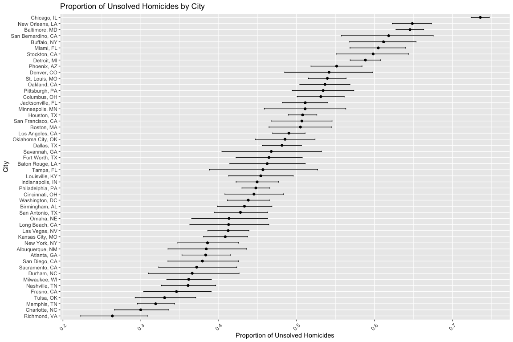
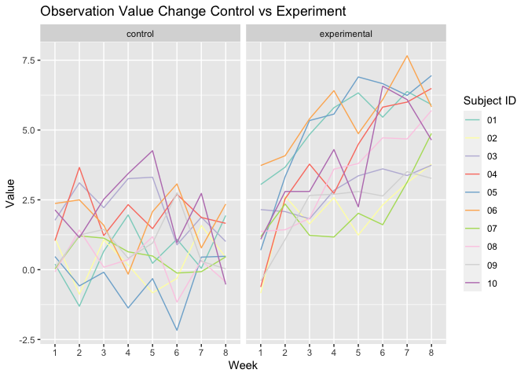
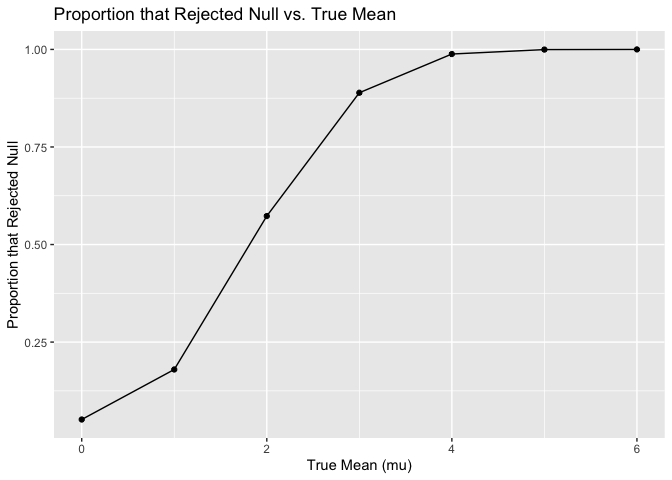
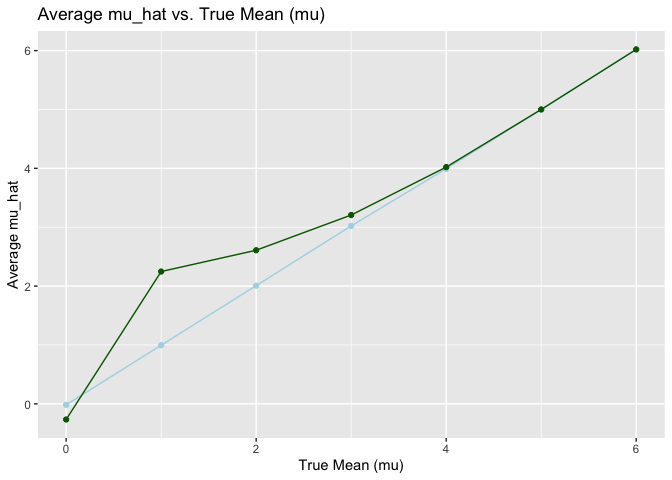

Homework5
================
Manye Dong
2023-11-06

``` r
library(tidyverse)
```

## Problem 1

``` r
homicide = read_csv("datasets/homicide-data.csv")
```

``` r
homicide_clean =
  homicide |>
  janitor::clean_names() |>
  mutate(state = replace(state, state == "wI", "WI"), 
         state = if_else(uid == "Tul-000769", "OK", state)) |> 
  mutate(city_state = paste(city, state, sep = ", ")) |>
  drop_na()
```

The data has 52119 criminal homicides and 13 columns from 2007 to 2017
in NM, GA, MD, LA, AL, MA, NY, NC, IL, OH, TX, CO, MI, CA, IN, FL, MO,
NV, KY, TN, WI, MN, OK, NE, PA, AZ, VA, DC States. It includes the
reported date, location of the homicide (latitude, longitude, city and
state), demographic information about each victim (first and last name,
race, age, sex) and the disposition of each record.

I modified the “Tulsa, AL” row because it is incorrectly put in the
state of Alabama instead of Oklahama. Thus, I changed the state from AL
to OK. I also detected that state WI is mistakenly written as wI, so I
changed that as well.

``` r
homicide_summarize = 
  homicide_clean |>
  group_by(city_state) |>
  summarise(total_homicide = n(), 
            unsolved_homicide = sum(disposition %in% c("Closed without arrest", "Open/No arrest")))

head(homicide_summarize)
```

    ## # A tibble: 6 × 3
    ##   city_state      total_homicide unsolved_homicide
    ##   <chr>                    <int>             <int>
    ## 1 Albuquerque, NM            375               144
    ## 2 Atlanta, GA                973               373
    ## 3 Baltimore, MD             2827              1825
    ## 4 Baton Rouge, LA            424               196
    ## 5 Birmingham, AL             799               346
    ## 6 Boston, MA                 612               309

Run prop.test for Baltimore, MD:

``` r
homicide_prop_test = 
  homicide_clean |>
  filter(city_state == "Baltimore, MD")

unsolved_count = sum(homicide_prop_test$disposition %in% c("Closed without arrest", "Open/No arrest"))

total_homicides = nrow(homicide_prop_test)

prop_test_result = prop.test(x = unsolved_count, n = total_homicides)
```

``` r
tidy_result = broom::tidy(prop_test_result)

tidy_result = 
  tidy_result |>
  select(estimate, conf.low, conf.high)

tidy_result
```

    ## # A tibble: 1 × 3
    ##   estimate conf.low conf.high
    ##      <dbl>    <dbl>     <dbl>
    ## 1    0.646    0.628     0.663

Run prop.test for each of the cities and extract both the proportion of
unsolved homicides and the confidence interval for each city_state:

``` r
run_prop_test = function(total, unsolved) {
  prop.test(x = unsolved, n = total)
}
```

``` r
nested_data = 
  homicide_clean |>
  group_by(city_state) |>
  summarize(total_homicide = n(), 
            unsolved_homicide = sum(disposition %in% c("Closed without arrest", "Open/No arrest"))) |>
  nest(data = c(total_homicide, unsolved_homicide))
```

``` r
results = 
  nested_data |>
  mutate(prop_test_results = map(data, ~run_prop_test(.x$total_homicide, .x$unsolved_homicide))) |>
  mutate(tidy_results = map(prop_test_results, broom::tidy)) |>
  select(city_state, tidy_results) |>
  unnest(tidy_results) |>
  select(city_state, estimate, conf.low, conf.high)

head(results)
```

    ## # A tibble: 6 × 4
    ##   city_state      estimate conf.low conf.high
    ##   <chr>              <dbl>    <dbl>     <dbl>
    ## 1 Albuquerque, NM    0.384    0.335     0.436
    ## 2 Atlanta, GA        0.383    0.353     0.415
    ## 3 Baltimore, MD      0.646    0.628     0.663
    ## 4 Baton Rouge, LA    0.462    0.414     0.511
    ## 5 Birmingham, AL     0.433    0.398     0.468
    ## 6 Boston, MA         0.505    0.465     0.545

Create a plot that shows the estimates and CIs for each city. Organize
cities according to the proportion of unsolved homicides:

``` r
results$city_state <- factor(results$city_state, levels = results$city_state[order(results$estimate)])

ggplot(results, aes(x = city_state, y = estimate)) +
  geom_point() +
  geom_errorbar(aes(ymin = conf.low, ymax = conf.high), width = 0.2) +
  coord_flip() +
  labs(x = "City", y = "Proportion of Unsolved Homicides", title = "Proportion of Unsolved Homicides by City") +
  theme(axis.text.x = element_text(angle = 45, vjust = 0.5))
```

<!-- -->

## Problem 2

Loading in data, add arm and make sure week variable is tidy:

``` r
process = function(path,filename) {
  df = 
    read_csv(path) |>
    janitor::clean_names() |>
    mutate(id = filename) |>
    pivot_longer(
      cols = -id,
      names_to = "week",
      values_to = "observation",
      names_prefix = "week_") |>
    separate(id,c("arm", "subject_id"),  sep = "_") |>
    mutate(
      arm = recode(arm, con = "control", exp = "experimental"),
      subject_id = gsub("\\.csv$","",subject_id))

  df
}
```

``` r
files = list.files("./datasets/study_data", full.names = TRUE)
```

``` r
tidied_df = 
  purrr::map(files, ~ process(.x, basename(.x))) |> 
  bind_rows()

head(tidied_df)
```

    ## # A tibble: 6 × 4
    ##   arm     subject_id week  observation
    ##   <chr>   <chr>      <chr>       <dbl>
    ## 1 control 01         1            0.2 
    ## 2 control 01         2           -1.31
    ## 3 control 01         3            0.66
    ## 4 control 01         4            1.96
    ## 5 control 01         5            0.23
    ## 6 control 01         6            1.09

Make a spaghetti plot:

``` r
tidied_df |>
  ggplot(aes(x = week, y = observation, color = subject_id)) +
  geom_line(aes(group = subject_id), se = FALSE) +
  facet_grid(~arm) +
  scale_color_brewer(palette = "Set3") + 
  labs(x = "Week", y = "Value", title = "Observation Value Change Control vs Experiment", col = "Subject ID")
```

<!-- -->

The values of observations for subjects in the experimental group seem
to be overall increasing from Week 1 to Week 8, while the values of
observations for subjects in the control group does not change much from
Week 1 to Week 8, though in both groups the values are fluctuating.

## Problem 3

``` r
set.seed(42)
```

Create a plot for association between true_mu and rejected_prop:

``` r
one_sample = function(mu, n = 30, sd = 5){
  x = rnorm(n = n, mean = mu, sd = sd)
  result = t.test(x, mu = 0, alternative = "two.sided", conf.level = 0.95) |>
    broom::tidy() |> 
    select(estimate, p.value)
}
```

Repeat the above process for 5000 times:

``` r
all_samples = 
  expand_grid(mu = c(0,1,2,3,4,5,6), iter = 1:5000) |> 
  mutate(df = map(mu, one_sample)) |> 
  unnest(df) |> 
  mutate(rejected = p.value < 0.05)
```

Clean the result df:

``` r
all_samples = 
  all_samples |>
  select(mu, estimate, p.value, rejected) |>
  rename("mu_hat"="estimate", "p_value"="p.value")
```

Make a plot:

``` r
all_samples |>  
  group_by(mu) |>  
  summarize(prop_rejected = mean(rejected)) |>
  ggplot(aes(x = mu, y = prop_rejected)) +
  geom_point() +
  geom_line() +
  labs(title = "Proportion that Rejected Null vs. True Mean", x = "True Mean (mu)", y = "Proportion that Rejected Null")
```

<!-- -->

The line plot above indicates a positive association between true value
of mu and the proportion of times the null was rejected. As the true
value of mu increases, the power of the test increases along with it.
When mu reaches 5 and 6, almost all tests show an result of rejecting
the null.

Make overlaid plots:

``` r
rejected_tests = 
  all_samples |>
  filter(rejected==TRUE) |>
  group_by(mu) |>
  summarise(avg_mu_hat = mean(mu_hat))


all_tests = 
  all_samples |> 
  group_by(mu) |>
  summarise(avg_mu_hat = mean(mu_hat))

ggplot() +
  geom_point(data = all_tests, aes(x = mu, y = avg_mu_hat), color = "lightblue") +
  geom_line(data = all_tests, aes(x = mu, y = avg_mu_hat), color = "lightblue") +
  geom_point(data = rejected_tests, aes(x = mu, y = avg_mu_hat), color = "darkgreen") +
  geom_line(data = rejected_tests, aes(x = mu, y = avg_mu_hat), color = "darkgreen") +
  labs(title = "Average mu_hat vs. True Mean (mu)", x = "True Mean (mu)", y = "Average mu_hat")
```

<!-- -->

The average estimate seems very close to the true mean mu when mu is
large. The average estimate for tests that reject null does not exactly
align with the true mean when mu is less than or equal to 4. But as the
true mean increases, the difference gets smaller and the mu_hat starts
to be approximately equal to the true value of mu.

The reason is that for smaller mu, it is more likely to have more
estimates towards 0. This means that only those estimates away from 0
will reject the null hypothesis. This, in turn, makes the power very
small for small value of mu. As mu increases, we would expect all or
almost all tests to have reject null because more points will deviate
from 0. Its power will then increase, making the two lines align with
each other for larger mu.
